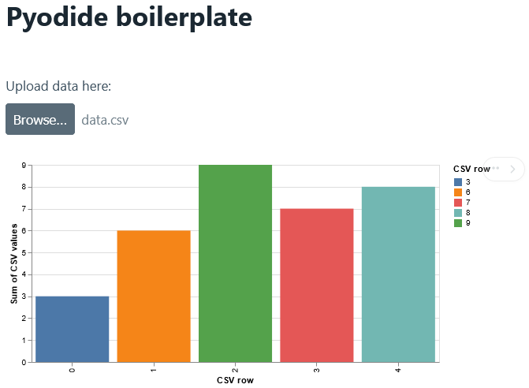

# Pyodide boilerplate
Load data, process it with Python, then visualise it; all in your web browser.



Simple boilerplate / demo for using pyodide and vega-lite plotting (and a simple GUI).

This is all a static website and you can try it out now at [akodiat.github.io/pyodide_boilerplate](https://akodiat.github.io/pyodide_boilerplate/).

The app takes a CSV file with two columns as input, sums the column values for each row (using numpy), then plots the sums as a bar plot.

You may use the `data.csv` file in the repository as input.

## Running locally
To run it locally, you need to start a http static server in this directory. You can easily do that with the following Python command ([or any of these other options](https://gist.github.com/willurd/5720255))

```sh
python -m http.server 8000
```

Then, you can go to [localhost:8000](HTTP:/localhost:8000) (or whatever port you used above) to view the app.

## Further reading
As seen in `index.html`, the app uses a set of JavaScript libraries loaded trough content delivery networks.

Storing and referencing the library files locally (in, say, a ./lib directory) should work just as well.

### Pico.css
[Pico.css](https://picocss.com/) is a simple way to make an HTML file look better. Try removing the stylesheet to see the difference. They have a list of UI elements and components here: https://picocss.com/docs.

### Pyodide
[Pyodide](https://pyodide.org/) is a Python distribution that can run in the browser (through WebAssembly), allowing you to call Python code from JavaScript. The main bottleneck in this app is the time it takes to load the pyodide runtime, so in practice you should probably have some more demanding code to run to make it worth the trouble. If you have a large Python package, it is best to build it as a wheel: https://pyodide.org/en/stable/usage/loading-custom-python-code.htm

### Papaparse
[Papaparse](https://www.papaparse.com/) is a JavaScript library that makes it easier to parse CSV files: https://www.papaparse.com/. If you want to parse a text file manually, you can instead do:
```js
const fileInput = document.getElementById("fileInput");
fileInput.onchange = () => {
  fileInput.files[0].text().then(text => {
    // Do what you want here
    console.log(text);
  })
};
```
https://developer.mozilla.org/en-US/docs/Web/API/Blob/text
